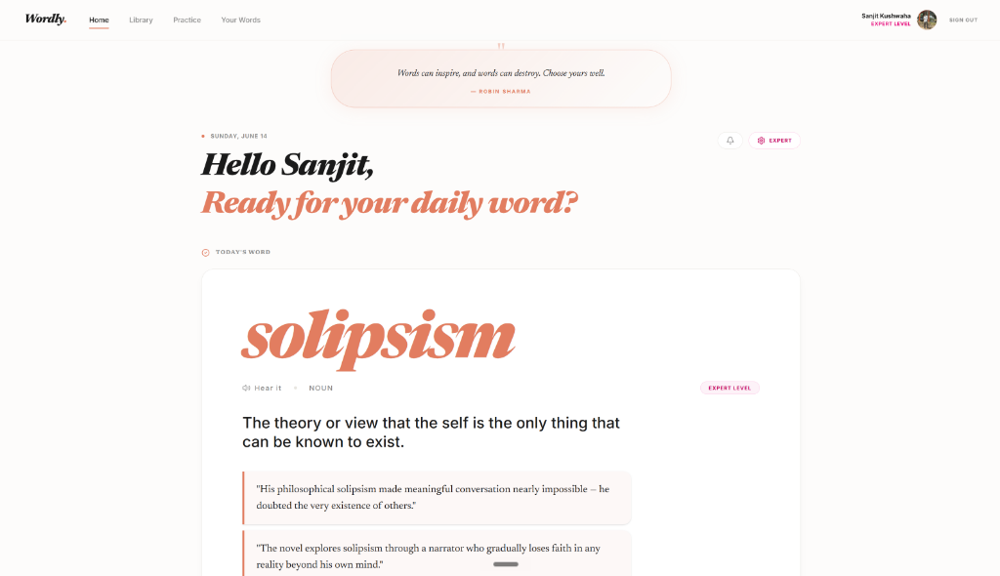
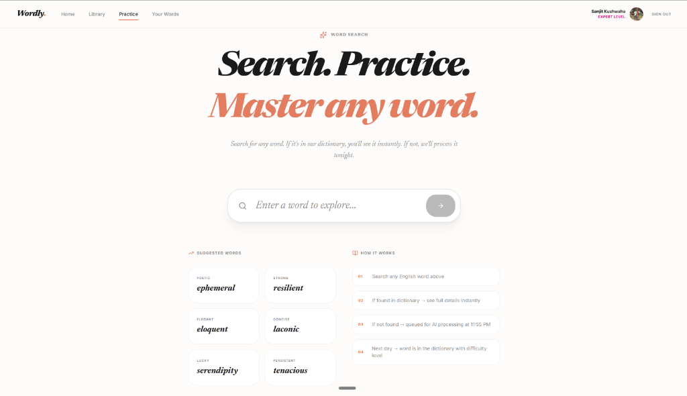

# Wordly V2 🧠📚

> AI-Powered Vocabulary & Communication App — Complete Architecture Rebuild

**Author:** Sanjit Kushwaha (4th Sem, AIML B.Tech)  
**Version:** 2.0 — Migration from V1 (Firebase Firestore → MongoDB)  
**Stack:** React 19 · TypeScript · MongoDB · Express · Gemini AI

---

## Screenshots

<div align="center">
  
  &nbsp;
  
  <p><em>(Add your screenshots as <code>dashboard.png</code> and <code>practice.png</code> inside a <code>docs/</code> folder to see them here!)</em></p>
</div>

---

## What's New in V2

| Feature | V1 | V2 |
|---|---|---|
| Database | Firebase Firestore | MongoDB (Mongoose) |
| AI Usage | Every interaction | Batch processing only |
| Revision | AI feedback | Self-assessment |
| Word of Day | Global same word | Personalized per user level |
| Dictionary | None | Growing word bank by difficulty |
| Spaced Repetition | ❌ | ✅ Ebbinghaus curve |
| Notifications | ❌ | ✅ In-app panel |
| Progress Heatmap | ❌ | ✅ GitHub-style |

---

## Difficulty Level Dictionary System

Every word in the dictionary is categorized into one of 4 difficulty buckets:

| Level | Description | CEFR |
|---|---|---|
| `beginner` | Common everyday words | A1-A2 |
| `intermediate` | Moderately complex words | B1-B2 |
| `advanced` | Sophisticated vocabulary | C1 |
| `expert` | Rare, academic, technical words | C2 |

### How it works

1. User searches for an unknown word (e.g. "ephemeral")
2. Word is queued in `word_requests` collection
3. At **11:55 PM**, the batch processor calls Gemini AI **once per word**
4. AI returns: meaning, sentence, synonyms, antonyms, etymology, part of speech, **and difficulty level**
5. Word is saved to the `dictionary` collection under its assigned level
6. Users who set their level to "advanced" will see "ephemeral" in their Word of Day
7. Beginner users will NOT see it until they progress

### Query by difficulty

```javascript
// Get all advanced words
Word.find({ level: 'advanced' })

// Get words a user hasn't seen yet at their level
Word.find({ level: 'advanced', word: { $nin: seenWords } })
```

---

## Setup

### 1. Clone and install

```bash
git clone https://github.com/Sanjit4066/wordly-v2
cd wordly-v2
npm install
```

### 2. Environment variables

```bash
cp .env.example .env
# Fill in MONGODB_URI, GEMINI_API_KEY, Firebase credentials
```

### 3. Seed the dictionary

```bash
npm run seed
# Adds starter words across all 4 difficulty levels
```

### 4. Run development server

```bash
npm run dev
# Server starts on http://localhost:5000
```

---

## API Reference

### Word Endpoints

| Method | Endpoint | Description |
|---|---|---|
| GET | `/api/word/search?q=ephemeral` | Search dictionary; queue if not found |
| GET | `/api/word/daily` | Personalized Word of Day by user level |
| GET | `/api/word/level/:level` | Browse words by difficulty level |
| GET | `/api/word/stats` | Dictionary count per difficulty level |

### Revision Endpoints

| Method | Endpoint | Description |
|---|---|---|
| GET | `/api/revision/due` | Words due for spaced repetition review |
| GET | `/api/revision/yesterday` | Yesterday's word for self-assessment |
| POST | `/api/revision/self-mark` | Submit got_it / needs_practice |

### Other Endpoints

| Method | Endpoint | Description |
|---|---|---|
| GET | `/api/sentences/:wordId` | User's sentences for a word |
| POST | `/api/sentences` | Save a new sentence |
| PUT | `/api/sentences/:wordId/:id` | Edit a sentence |
| DELETE | `/api/sentences/:wordId/:id` | Soft delete a sentence |
| GET | `/api/notifications` | Fetch notifications |
| GET | `/api/notifications/count` | Unread badge count |
| PUT | `/api/notifications/mark-read` | Mark all as read |
| GET | `/api/quiz/current` | This week's quiz |
| POST | `/api/quiz/:id/submit` | Submit quiz answers |
| GET | `/api/progress/heatmap` | Activity heatmap data |
| GET | `/api/progress/streak` | Current streak count |
| GET | `/api/progress/mastery` | Mastery level breakdown |

### Admin Endpoints (requires `x-admin-key` header)

| Method | Endpoint | Description |
|---|---|---|
| POST | `/api/admin/trigger-batch` | Manually run batch processor |
| POST | `/api/admin/trigger-quiz` | Manually run quiz generator |
| GET | `/api/admin/dictionary-stats` | Words per level + pending requests |

---

## Cron Jobs

| Job | Schedule | Description |
|---|---|---|
| Batch Word Processor | 11:55 PM daily | Process pending word requests → categorize by difficulty |
| Quiz Generator | 11:00 PM Monday | Pre-generate weekly MCQ quizzes |
| SR Reminder | 9:00 AM daily | Notify users of words due for review |

---

## Spaced Repetition Schedule

Based on the Ebbinghaus Forgetting Curve:

| Review | Self Mark | Next Review | Mastery |
|---|---|---|---|
| First seen | — | +1 day | Seen |
| Review 1 | Got it | +3 days | Practiced |
| Review 2 | Got it | +7 days | Familiar |
| Review 3 | Got it | +30 days | Familiar+ |
| Review 4+ | Got it | +60 days | Mastered |
| Any | Need practice | +1 day | Unchanged |

---

## AI Budget (20 calls/day)

| Feature | AI Calls | Frequency |
|---|---|---|
| Word of Day | 0 | Pure DB query |
| Word search (found) | 0 | Dictionary hit |
| Batch word requests | 1 per unique word | 11:55 PM |
| Weekly quiz | 1-2 | Monday 11 PM |
| **Typical weekday** | **0-5** | — |
| **Worst case (Monday)** | **~17** | — |

---

## Project Philosophy

> "Dictionary first. AI only for the gaps."

Every word processed by AI today is **free forever after**. The dictionary grows daily. By Day 90, most searches hit the dictionary directly — AI calls approach zero.

---

*Built with purpose. Shipped with clarity. — Sanjit Kushwaha, 4th Sem AIML*
